# 3Kings - User Guide

## What is 3Kings?

**3Kings** is a tactical simulation war game for MSX, set in the age of the Three Kingdoms.
With simple controls, you conquer provinces, fight battles, and aim to unite all 14 provinces.

The game is designed to let you enjoy the atmosphere of rival warlords in a fast and compact form.

## Objective

Choose a scenario and ruler, then expand your power through repeated strategy and military phases.
The game avoids overly complex numbers. With short turns and easy-to-read battles, you decide which provinces to defend, where to send troops, and when to attack.

Your goal is to conquer all 14 provinces and unite the realm.

## Game Flow

After startup, choose the language, level, scenario, and player ruler to begin the game.
For first-time players, Easy is recommended.

There are two scenarios. Each scenario has different starting powers, rulers, provinces, and abilities.

The main game proceeds in turns. Each turn consists of a Strategy Phase and a Military Phase.
After all powers finish both phases, the turn advances by one.

## Controls

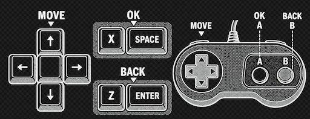

Move the cursor with the cursor keys or a joystick/gamepad.
Use X or SPACE to confirm. Use Z or ENTER to cancel or go back.

When using a gamepad, A is confirm and B is cancel.

In battle, moving into a square occupied by an enemy unit triggers an attack.
Move toward the enemy unit you want to attack.

## Strategy Phase

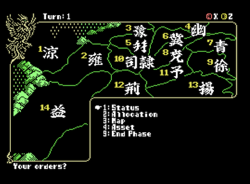

The screen shows the national map divided into provinces.

1. The upper-left area shows the current turn. When every power has finished acting, the game moves to the Military Phase.

2. The national map shows how provinces are connected. First, check where your provinces are and which powers border you. You can inspect this using the command window in the lower-right area.

3. During enemy turns, the lower-right window shows the province and ruler list. During the player's turn, it shows the command list. Move the cursor and choose commands from this window.

4. The bottom area is the message area.

### Commands

| No. | Command | Description |
| :--- | :--- | :--- |
| 1 | Status | Shows the player ruler's status. |
| 2 | Allocation | Sets growth allocation for the ruler's abilities. This is one of the most important choices in the phase. |
| 3 | Map | Checks information about other powers. |
| 4 | Asset | Checks owned items and recruited officers. |
| 9 | End Phase | Ends the player's Strategy Phase. |

### 1. Status

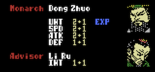

Choose Status to check the current ruler's abilities.

| Item | Type | Description |
| :--- | :--- | :--- |
| UNT | Unit count | Represents the ruler's military strength. Higher values give an advantage in battle. |
| SPD | Speed | Represents unit mobility. Higher values increase the number of movement and attack actions available in battle. |
| ATK | Attack | Represents attack power. It affects hit rate and damage checks. |
| DEF | Defense | Represents defensive power. It affects hit rate and damage checks when attacked. |
| INT | Tactics | Affects tactics available before battle. Higher values allow stronger tactics. |
| EXP | Experience | Experience gained at the end of each turn. Destroying an enemy power increases the gained experience. When enough experience is accumulated, an ability rises by +1, up to a maximum of 9. |

**What is an Advisor?**

Some rulers have an Advisor. When a ruler has one, the Advisor's ability is applied.
This allows powerful tactics to be used in battle.

### 2. Allocation

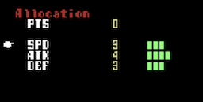

The ruler's SPD, ATK, and DEF each have their own experience.
When enough experience is accumulated, the ability levels up.

In Allocation, choose how to distribute experience points.
There are 10 points. Use left and right to adjust the amount assigned to each ability.
After deciding the allocation, press confirm. Press cancel to discard the allocation.

**This is one of the most important decisions in the phase.**
Allocate points according to the strengths and weaknesses of your ruler.

### 3. Map

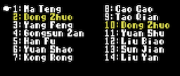

The Map command shows a list of all 14 provinces and their rulers.
The province numbers correspond to the numbers shown on the map screen.

The player ruler is shown in dark yellow, and allied rulers are shown in light yellow.

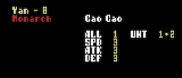

Move the cursor in the list and press confirm to check information about the power controlling that province.

| Item | Type | Description |
| :--- | :--- | :--- |
| ALL | Controlled provinces | Number of provinces controlled by the ruler. |
| UNT | Unit count | Military strength in that province. This is the number of units stationed in the province plus a bonus value. The bonus is assigned to the ruling monarch, regardless of province. |
| SPD | Speed | Unit mobility. |
| ATK | Attack | Unit attack power. |
| DEF | Defense | Unit defensive power. |

**What is the unit bonus?**

Each ruler has a bonus value representing the strength of that power.
This value is set by scenario and is also affected by the selected Difficulty.
Higher Difficulty settings increase the bonus value for all powers.

Because at least +1 is always added, even if all movable units leave a province, the province still retains strength equal to the bonus value.
Think of it as reserve troops stationed there.

### 4. Asset

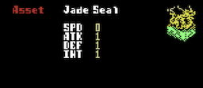

Assets show items owned by the ruler and officers recruited into the ruler's service.

Move the cursor in the list and press confirm to check details.

SPD, ATK, DEF, and INT are passive abilities added to the owning ruler.
INT only takes effect when the ruler has an Advisor.

Some Assets are owned from the start of the game, while others are gained through events triggered by specific conditions.

### 9. End Phase

Ends the player's Strategy Phase.
When every ruler has finished the Strategy Phase, the game moves to the Military Phase.

## Military Phase

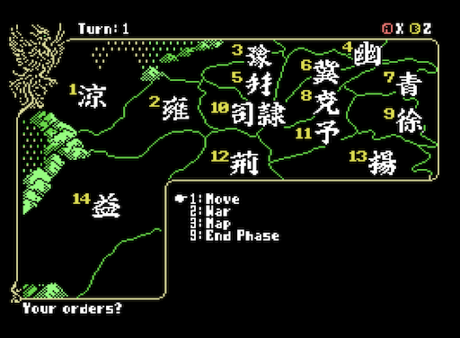

In the Military Phase, you move units and start wars.
Actions in this phase are reserved first, then movement and battles are resolved together at the end of the phase.

CPU powers act on the same map, and wars can occur between non-player powers as well.

1. The upper-left area shows the current turn. When every power has finished acting, the turn advances and the next Strategy Phase begins.

2. This phase is used for Move and War commands. First, check where your provinces are and which powers border you. You can inspect this using the command window in the lower-right area.

3. During the player's turn, the lower-right window shows the military command list. Move the cursor and choose commands from this window.

4. The bottom area is the message area.

### Commands

| No. | Command | Description |
| :--- | :--- | :--- |
| 1 | Move | Moves units from one province to another. |
| 2 | War | Attacks a province controlled by an enemy power. |
| 3 | Map | Checks information about other powers. |
| 9 | End Phase | Ends the player's Military Phase. |

Military actions require AP.

**What is AP?**

AP increases according to the number of provinces you control.
If you do not have enough AP, you cannot execute the command.
AP is restored each turn.

### Military - 1. Move

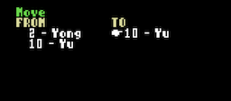

If you control two or more provinces and those provinces are connected, the Move command becomes available.
This lets you move troops to another province.

Choose the source province from the FROM list and press confirm.
The cursor moves to the TO list. Choose the destination province and press confirm.
Press cancel if you want to cancel the operation before confirming.

Once movement is confirmed, it is reserved. Units from the FROM province enter a ready state.
This decision cannot be cancelled until the turn ends.

If multiple units are stationed in a province, movement is reserved one unit at a time.
To move multiple units from the same province, choose the FROM province again.

### Military - 2. War

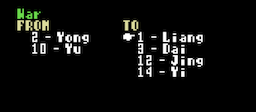

If an enemy province is directly adjacent to one of your provinces, the War command becomes available.
This lets you start a war.

Even if the enemy province is not directly adjacent to your province, you can also attack an enemy province through one province controlled by an allied power.

Choose the source province from the FROM list and press confirm.
The cursor moves to the TO list. Choose the target province and press confirm.
Press cancel if you want to cancel the operation before confirming.

Once war is confirmed, it is reserved. Units from the FROM province enter a ready state.
This decision cannot be cancelled until the turn ends.

If multiple units are stationed in the province, all units participate in the war.

### Military - 9. End Phase

Ends the player's Military Phase.
When every ruler has finished the Military Phase, battles between powers are resolved.

## Battle Mode

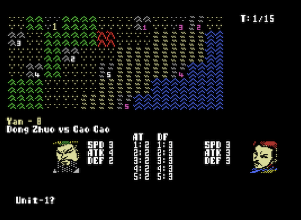

When a battle occurs between powers, the screen changes to Battle Mode.

Movement and war actions are processed in order: movement is resolved first, then battles begin.
For example, if you reserve a War command and then use Move in the same turn, the battle occurs after movement has been resolved.

1. The upper-right area shows the current battle turn. Each battle lasts up to 15 turns. If neither side wins within 15 turns, the battle ends in a draw.

2. The battlefield terrain for the province is shown, and both armies are placed randomly. The attacker is shown in white, and the defender is shown in purple.

3. The lower window shows the attacking power on the left and the defending power on the right.

4. The bottom area is the message area.

### Stratagems Activated Before Battle

When a battle begins, a Advisor may propose a stratagem if one is present in the army.
There are eight types of stratagems:

|No.|Stratagem|Cost|Effect|
| :--- | :--- | :--- | :--- |
|1|Spped|1+|Increases allied SPD by +1|
|2|Attack|1+|Increases allied ATK by +1|
|3|Defence|1+|Increases allied DEF by +1|
|4|Raid|2+|Launches one preemptive attack against random enemy units. The number of targets depends on the stratagem value.|
|5|Confuse|2+|Attempts to inflict confusion on random enemy units before battle. The number of targets depends on the stratagem value.|
|6|Fire|3+|Launches two preemptive attacks against random enemy units. The number of targets depends on the stratagem value.|
|7|Siege|3+|Adds +5 to the elapsed turn count. Battles will reach a draw more quickly. Favorable to defenders.|
|8|???|8+|Can only be activated when Kongming and Zhou Yu are allied at Red Cliffs. An extremely powerful stratagem.
|
### Unit Structure

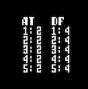

Units placed on the terrain are represented as units 1 through 5.
Each unit is controlled as one group.
The lower window shows the strength of the attacking units on the left and the defending units on the right.

### Movement and Attack

Player units can be moved with the cursor keys.
The number of actions available in a turn depends on the ruler's SPD.
Rulers with high mobility can move across more squares.

| SPD | Movement points |
| :--- | :--- |
| 0 | 2 |
| 1 | 2 |
| 2 | 3 |
| 3 | 3 |
| 4 | 4 |
| 5 | 4 |
| 6 | 5 |
| 7 | 5 |
| 8 | 6 |
| 9 | 6 |

In battle, moving into a square occupied by an enemy unit triggers an attack.
Move toward the enemy unit you want to attack.

### Terrain

The battlefield shows the terrain of the province where the battle occurs.
Each of the 14 provinces has different terrain.
Using terrain suited for attack or defense can help you gain an advantage.

There are five terrain types.

| No. | Terrain | Image | Movement cost | Effect |
| :--- | :--- | :--- | :--- | :--- |
| 1 | Plains |  | 1 | No terrain modifier |
| 2 | Forest | 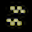 | 1 | Defender +1 |
| 3 | Hills |  | 2 | Defender +2 |
| 4 | Mountains |  | Impassable | Cannot enter |
| 5 | Sea |  | Impassable | Cannot enter |

If a unit does not have enough movement points, it cannot move.
Attacking an enemy unit consumes 1 point.

### Victory Conditions

- You win when the enemy's first unit reaches 0 strength.
- You lose when your first unit reaches 0 strength.
- If 15 turns pass, the battle ends in a draw and the defender successfully holds the province.

### After Battle

#### 1. If the attacker wins

The winning power occupies the target province and brings it under control.

Even if the attacker wins, units return to the province they marched from after the battle.

#### 2. If the player loses

If the player loses as the attacker, the attacking force retreats.
If the player loses as the defender, the player loses the province.
If all player-controlled provinces are lost, the game is over.

#### 3. After all battles are resolved

When all battles are finished, the Military Phase ends and the game returns to the Strategy Phase.
