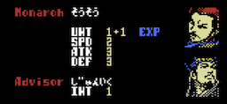
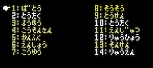
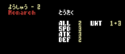
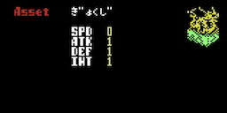
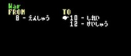
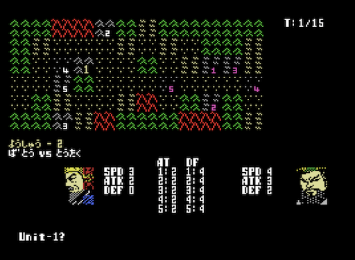

# 3Kings - ユーザーガイド

## 3Kingsとは

**3Kings** は、三国志の時代を舞台にした、MSX 向けの戦術級シミュレーション・ウォーゲームです。
シンプルな操作で、14州の制圧、戦闘を進め、全州統一を目指します。

群雄割拠の雰囲気を、スピーディかつテンポ良く楽しめる構成となっています。

## ゲームの目的

プレイヤーは好きなシナリオと君主を選び、政略と軍事を繰り返しながら勢力を広げていきます。
複雑な数値はありません。シンプルな操作で、短いターン進行と分かりやすい戦闘になっており、プレイヤーは限られた行動機会の中で、どの州を守り、どこへ兵を進め、どの戦闘を仕掛けるかを判断します。

全国 14州をすべて制圧し、天下統一を目指すことが、あなたの目的となります。

## ゲームの流れ

起動後、日本語か英語かを選択し、難易度、シナリオ、プレイヤー君主を選択して本編へ入ります。
初めてプレイされる方はEasyを選択することをお勧めします。

シナリオは二つ用意されており、それぞれ異なる初期勢力、登場君主、統治州、能力が設定されています。

本編はターン制で進行し、ターンは「政略フェーズ」と「軍事フェーズ」で構成されます。それぞれのフェーズで各勢力が行動し、軍事フェーズまでが終わると、ターンが1つ進みます。

## ゲームの操作

[カーソルキー] または [ジョイスティック/ゲームパッド] でカーソルを移動できます。
決定は、[X] または [SPACE]、キャンセル/戻る は [Z] または [ENTER] を押してください。

ゲームパッドを利用する場合は、[A]が決定、[B]がキャンセルになります。

戦闘画面では、敵ユニットがいるマスに移動すると攻撃判定となります。攻撃したい敵に近づいたら、敵ユニットのいる方向に移動しましょう。

## 政略フェーズ

画面は、全国マップが州ごとに分割され、表示されています。

①画面の左上に現在のターンを表示しています。全ての勢力が行動を終えると、軍事フェーズへ移ります。

②全国地図が表示されます。ここでは、それぞれの州の地形的な繋がりを確認できます。まずは、プレイヤーがどの州にいるか、どの勢力を隣接しているかを確認しましょう。確認は画面右下のウインドウからコマンドを選択することで行えます。

③画面右下のウインドウは、敵勢力の行動中は州および支配君主のリストを表示しています。プレイヤーのターンになると、コマンドリストが表示されます。ここからカーソルを移動させてコマンドを選択することで命令を出します。

④画面下部は、状況などを表示するメッセージエリアです。

### コマンド選択

|No.|表示|説明|
| :--- | :--- | :--- |
|1|Status|プレイヤー君主の能力を表示します。|
|2|Allocation|君主の能力値の成長配分を設定します。このフェーズでの最も重要な決定になります。|
|3|Map|敵勢力の情報を確認します。|
|4|Asset|所持しているアイテムや武将を確認します。|
|9|End Phase|プレイヤーの政略フェーズを終了します。|

### 1. Status

Statusを選択すると、現在の君主の能力値を確認することができます。

|項目|分類|説明|
| :--- | :--- | :--- |
|UNT|ユニット数|現在の君主の兵力数を表します。この数値が大きいほど、多くの兵力を有しており、戦闘を有利に進めることができます。|
|SPD|スピード|ユニットの機動力です。この数値が大きいほど、戦闘時に一回に移動・攻撃できる回数が増えていきます。|
|ATK|攻撃力|ユニットの攻撃力です。攻撃時の命中率とダメージ判定に影響します。|
|DEF|防御力|ユニットの防御力です。攻撃時の命中率とダメージ判定に影響します。|
|INT|計略|戦闘開始前に発動する計略に影響します。この数値が高いほど強力な計略を使うことができます。|
|EXP|経験値|毎ターンの終了時に獲得できる経験値です。また敵勢力を滅亡させると獲得経験値がさらに上がります。経験値が貯まると能力値が+1されます。ただし、上限は9です。|

**Advisor(軍師)とは？**

このゲームでは、軍師を配下にしている君主がいます。その場合は、Advisor(軍師)の能力が適用されます。この能力があると、戦闘時に強力な計略を使うことが出来るようになります。

### 2. Allocation

君主の能力である 移動(SPD)、攻撃(ATK)、防御(DEF)には、それぞれ経験値があり、一定の経験値になるとレベルアップして能力が上昇します。

ここでは、どの能力に経験値を分配するかを選択します。ポイントは10ポイントあり、カーソルの左右で分配するポイント数を変更できます。分配が決まったら、決定キーを押してください。キャンセルキーを押すと、分配をキャンセルできます。

**このフェーズでの最も重要な決定です。**
プレイヤー君主の能力に応じて、適切にポイントを振り分けましょう。

### 3. Map

マップ画面に表示されている全14州の州番号とその支配者がリストで表示されます。州番号は、マップ画面に表示されている番号に対応しています。このリストで州の支配者を確認することが出来ます。

プレイヤー君主は濃い黄色の文字で表示され、同盟関係にある君主は薄い黄色の文字で表示されます。

リスト上でカーソルを移動させ、決定キーを押すと、その州を支配している勢力の情報を確認できます。

|項目|分類|説明|
| :--- | :--- | :--- |
|ALL|支配州数|現在の君主の支配している州数を表します。|
|UNT|ユニット数|現在の君主の兵力数を表します。その州に駐屯するユニット数+加算値が表示されています。加算値は州に関係なく支配者である君主に与えられているボーナス値です。|
|SPD|スピード|ユニットの機動力です。|
|ATK|攻撃力|ユニットの攻撃力です。|
|DEF|防御力|ユニットの防御力です。|

**ユニットのボーナス値とは？**

支配者である君主には、その勢力としての強さを表すボーナス値が設定されています。これはシナリオごとの初期値として決められており、かつ選択した難易度によって増減します。より高い難易度を選択すると、全ての勢力のボーナス値が上昇します。

このボーナス値は最低でも+1が必ず加算されているため、州からユニットを移動させて、その州に残るユニットが0になった場合も+ボーナス値分の兵力は、常にその州に駐屯していることになります。予備兵のようなものだと考えてください。

### 4. Asset

君主が所持しているアイテム、または配下に加えている武将がリストで表示されます。

リスト上でカーソルを移動させ、決定キーを押すと、対象の情報を確認できます。

移動(SPD)、攻撃(ATK)、防御(DEF)、計略(INT)は、それぞれ所有する君主の能力に加算されるパッシブ・アビリティです。計略(INT)については、君主にAdvisor(軍師)がいる場合にのみ効果があります。

Assetはゲーム開始時に初めから所有しているものと、特定の条件を満たした場合に発生するイベントによって獲得できるものがあります。

### 9. End Phase

プレイヤーの政略フェーズを終了します。全ての君主の政略フェーズが終了すると、軍事フェーズへ移行します。

## 軍事フェーズ

軍事フェーズでは、ユニットの移動(Move)と戦争(War)を行います。行動は、このフェーズでは予約となり、フェーズ終了時に移動および戦闘がまとめて行われます。

CPU 勢力も同じマップ上で行動し、プレイヤー以外の勢力同士でも戦争が発生します。

①画面の左上に現在のターンを表示しています。全ての勢力が行動を終えると、ターンが進行し、次の政略フェーズが始まります。

②ここでは、ユニットの移動(Move)と戦争(War)を行います。まずは、プレイヤーがどの州にいるか、どの勢力を隣接しているかを確認しましょう。確認は画面右下のウインドウからコマンドを選択することで行えます。

③画面右下のウインドウは、プレイヤーのターンになると、軍事コマンドリストが表示されます。ここからカーソルを移動させてコマンドを選択することで命令を出します。

④画面下部は、状況などを表示するメッセージエリアです。

### コマンド選択

|No.|表示|説明|
| :--- | :--- | :--- |
|1|Move|州にいるユニットを別の州に移動します。|
|2|War|敵勢力のいる州に進軍して戦争を仕掛けます。|
|3|Map|敵勢力の情報を確認します。|
|9|End Phase|プレイヤーの軍事フェーズを終了します。|

軍事行動にはAP(アクションポイント)が必要です。

**AP(アクションポイント)とは？**

支配する州の数に応じてAPが増加します。APが足りない場合は、コマンドを実行できません。APは毎ターンごとに回復します。

### 軍事 - 1. Move

プレイヤーの支配する州が2つ以上あり、かつ、その州同士が隣接している場合、移動(Move)コマンドを選択できるようになります。これにより、兵力を別の州へ移動させることができます。

FROM にリスト表示されている州の中から、ユニットを移動させる州をカーソルで選択し、決定キーを押してください。カーソルがTO のリストに移動するので、移動先の州を選択し、決定キーを押してください。途中で移動をキャンセルしたい場合は、キャンセルキーを押してください。

移動は一度決定すると行動が予約され、FROM で指定した州からユニットが行動準備に入ります。この決定はターンが終わるまで取消はできません。

州に複数のユニットが駐屯している場合、移動は1ユニットずつ予約していくことになるので、同じ州から複数のユニットを移動させたい場合は、再度、FROM から移動させる州を選択してください。

### 軍事 - 2. War

プレイヤーの支配する州に直接隣接している敵州がある場合、戦争(War)コマンドを選択できるようになります。これにより、戦争を仕掛けることができます。

また、自分の州に隣接していない場合であっても、同盟関係にある勢力の州を1つ挟んだ先の敵州へも戦争を仕掛けることができます。

FROM にリスト表示されている州の中から、進軍させる州をカーソルで選択し、決定キーを押してください。カーソルがTO のリストに移動するので、進軍先の州を選択し、決定キーを押してください。途中で移動をキャンセルしたい場合は、キャンセルキーを押してください。

戦争は一度決定すると行動が予約され、FROM で指定した州からユニットが行動準備に入ります。この決定はターンが終わるまで取消はできません。

州に複数のユニットが駐屯している場合、すべてのユニットが戦争に参加します。

### 軍事 - 9. End Phase

プレイヤーの軍事フェーズを終了します。全ての君主の軍事フェーズが終了すると、勢力同士での戦闘モードへ移行します。

## 戦闘モード

勢力同士での戦闘が発生すると画面が切替わり、戦闘モードへ移行します。

移動・戦争の行動は、まず最初に移動処理が行われます。その後、戦闘モードに移行します。そのため、戦争(War)コマンドで進軍した後で移動(Move)コマンドを実行した場合、同じターン内であれば、ユニットの移動後に戦闘が発生することになります。

①画面の右上に現在の戦闘ターンを表示しています。一回の戦闘は15ターンで構成されています。15ターン以内に決着がつかない場合は引き分けとなります。

②画面には、戦闘が発生した州の地形が表示され、ランダムに両軍のユニットが配置されます。攻撃側が白、防御側が紫で表示されます。

③画面下のウインドウは、左側に攻撃側の勢力、右側に防御側の勢力が表示されます。

④画面下部は、状況などを表示するメッセージエリアです。

### 戦闘開始前に発動する計略

戦闘が発生すると、軍師がいる場合、計略を提案してきます。
計略は以下の8種類があります。

|No.|計略|計略コスト|効果|
| :--- | :--- | :--- | :--- |
|1|Spped|1以上|味方の SPD +1|
|2|Attack|1以上|味方の ATK +1|
|3|Defence|1以上|味方の DEF +1|
|4|Raid|2以上|ランダムな敵部隊を対象に先制攻撃を一回行う。対象数は計略値に依存。|
|5|Confuse|2以上|ランダムな敵部隊を対象に事前に混乱を仕掛ける。対象数は計略値に依存。|
|6|Fire|3以上|ランダムな敵部隊を対象に先制攻撃を２回行う。対象数は計略値に依存。|
|7|Siege|3以上|経過Turnに+5する。引き分けになるまでのターンが短くなる。守り側に有利。|
|8|???|8以上|孔明と周瑜が赤壁で連合している時のみ発動可能。極めて強力な計略。|

### 部隊構成

地形に配置されたユニットは1〜5部隊で表現され、それぞれの部隊を1単位として操作します。
画面下のウインドウには、左側に攻撃側、右側に防御側のユニットの兵力が表示されます。

### 移動と攻撃

プレイヤーのユニットはカーソルキーで移動することができます。
ユニットは移動(Move)の能力によってターン内で行動できる回数が決まっています。
機動力に優れた君主は、より多くのマスを移動できます。

|移動(SPD)|移動ポイント|
| :--- | :--- |
|0|2|
|1|2|
|2|3|
|3|3|
|4|4|
|5|4|
|6|5|
|7|5|
|8|6|
|9|6|

戦闘画面では、敵ユニットがいるマスに移動すると攻撃判定となります。攻撃したい敵に近づいたら、敵ユニットのいる方向に移動しましょう。

### 地形

戦闘が発生した州の地形を表した画面が表示されます。全14州それぞれに特徴が違います。攻撃に適した地形、防御に適した地形などがあり、その特徴を活かした戦いをすることで戦闘を有利に進めることができます。

地形は以下の5種類があります。

|No.|地形||移動コスト|地形効果|
| :--- | :--- | :--- | :--- | :--- |
|1|平野||1|地形補正なし|
|2|森林||1|防御側に+1|
|3|山||2|防御側に+2|
|4|山岳||移動不可|侵入不可|
|5|海||移動不可|侵入不可|

ユニットの移動ポイントが足りなくなった場合、移動ができなくなります。
また、敵ユニットに攻撃する場合は、1ポイントを消費します。

### 勝利条件

- 敵の第一部隊の兵力が0になった時、勝利となります。
- プレイヤーの第一部隊の兵力が0になった時、プレイヤーの敗北となります。
- 15ターン経過した場合は、引き分けとなり、防御側の拠点防衛成功となります。

### 戦闘終了後

#### ①攻撃側が処理した場合

戦闘に勝利した勢力は、攻撃先の州を占領し、支配下に収めます。

戦闘が終わると勝利した場合であってもユニットは進軍元の州に戻ります。

#### ②戦闘に負けた場合

プレイヤーが攻撃側として戦闘に負けた場合は、撤退となります。防御側として戦闘に負けた場合は、支配下にある州を失います。支配しているすべての州を失うと、ゲームオーバーとなります。

#### ③すべての勢力の戦闘が終了した場合

すべての勢力の戦闘が終了すると、軍事フェーズが終了し、再び政略フェーズへ移行します。
